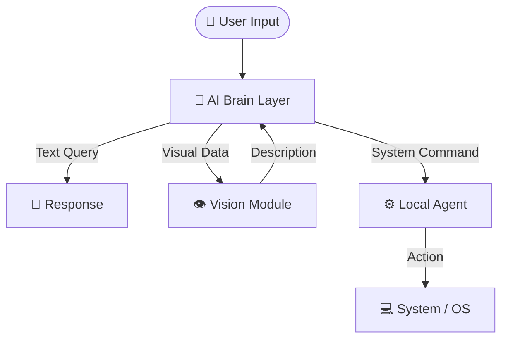

<h1 align="center">JARVIS</h1>

[](https://opensource.org/licenses/MIT)


<p align="justify">
<a href="https://jarvis-byte-me.vercel.app/">JARVIS</a> is an AI-powered personal assistant designed to bridge the gap between intelligence and execution. Unlike conventional assistants that stop at conversation, JARVIS extends its capabilities into your local operating system - opening applications, managing system controls, navigating the web, and responding visually to the world around it.

At its core, JARVIS is a modular, locally-aware AI system that combines cloud-level reasoning with on-device control. It listens, understands, decides, and does things, bringing the concept of a truly functional AI assistant closer to reality.
</p>
<hr>

<hr>

<hr>

##  Tech Stack

<div align="center">

| **Category**              | **Technologies** |
|---------------------------|:-----------------|
| **Programming Languages** | [](https://docs.python.org/3/) |
| **AI / LLM**              | [](https://groq.com/) |
| **Vision Models**         | [](https://arxiv.org/abs/2201.12086) |
| **Memory / Vector DB**    | [](https://docs.trychroma.com/) |
| **Web Search**            | [](https://serper.dev/) |
| **Backend Framework**     | [](https://fastapi.tiangolo.com/) |
| **Frontend Framework** | [](https://react.dev/) [](https://www.typescriptlang.org/docs/) |
| **Local Automation**      | [](https://docs.python.org/3/library/os.html) [](https://docs.python.org/3/library/subprocess.html) [](https://pyautogui.readthedocs.io/en/latest/) |
| **Tools**                 | [](https://git-scm.com/doc) [](https://code.visualstudio.com/docs) |
| **Deployment / Runtime**  | [](https://www.uvicorn.org/) |

</div>

---

## 🏗️ System Architecture

JARVIS operates on a **modular architecture** designed for **speed, privacy, and extensibility**.  
The system is divided into three core components: the **AI Brain Layer**, **Vision Module**, and **Local Agent**.



## 🧩 Core Modules

JARVIS is built on three primary components that work together to understand, analyze, and execute user commands.

---

### 🧠 1. AI Brain Layer
**The intelligence core that thinks, decides, and orchestrates actions.**

**Powered by:** Groq LLM

The AI Brain acts as the **central decision engine**. It interprets user input, understands intent, and determines the appropriate course of action.

**Responsibilities:**
1. **Natural Language Understanding:** Interprets complex and conversational queries.
2. **Decision Engine:** Chooses whether to respond, analyze visuals, or execute a command.
3. **Task Routing:** Directs requests to the Vision Module or Local Agent.

---

### 👁️ 2. Vision Module
**The perception system that allows JARVIS to “see” and understand images.**

**Powered by:** BLIP (Image Captioning)

This module converts visual input into meaningful textual descriptions that the AI Brain can process and reason about.

**Capabilities:**
1. **Image-to-Text Conversion:** Generates accurate image descriptions.
2. **Visual Question Answering (VQA):** Answers questions based on image content.
3. **Scene Analysis:** Identifies objects, context, and relationships.

---

### ⚙️ 3. Local Agent
**The action layer that interacts directly with the operating system.**

**Runs on:** Local Host (Low latency & secure)

The Local Agent transforms decisions into **real system actions**, enabling JARVIS to control applications and system settings.

**Functions:**
1. **Application Control:** Open, close, and manage programs.
2. **System Adjustments:** Modify volume, brightness, and power settings.
3. **Web Automation:** Launch websites and perform browser tasks.

---
## 📂 Project Structure

```text
JARVIS/
├── backend/                        # Main Server & Logic
│   ├── brain/                      # AI Intelligence Modules
│   │   ├── llm_services.py         # Connects to LLM (Groq/Ollama)
│   │   ├── local_multimodal.py     # Image recognition logic
│   │   ├── memory_manager.py       # Handles chat history & context
│   │   ├── speech_services.py      # STT and TTS handlers
│   │   └── web_search.py           # Google Search integration
│   ├── chroma_db/                  # Vector Database for Long-term memory
│   ├── main.py                     # FastAPI Entry Point (Run this to start)
│   ├── auth.py                     # User Authentication & Security
│   ├── agent.exe                   # Compiled Local Agent executable
│   └── users.db                    # User database
│
├── frontend/                       # User Interface (React + Vite)
│   ├── src/
│   │   ├── components/
│   │   │   ├── ChatInterface.tsx   # Main chat window
│   │   │   ├── Login.tsx           # Authentication screen
│   │   │   └── Sidebar.tsx         # Chat history navigation
│   │   ├── api.ts                  # Connection to Backend
│   │   ├── App.tsx                 # Main Application Layout
│   │   └── main.tsx                # Frontend Entry Point
│   ├── package.json
│   └── vite.config.ts
│
├── local_agent/                    # OS Control Source Code
│   ├── agent.py                    # Websocket client for OS commands
│   └── os_controller.py            # Logic to open apps/control system
│
├── voices/                         # Audio Assets
│   └── jarvis_voice.wav            # Reference audio for voice cloning
│
├── requirements.txt                # Python Dependencies
└── README.md                       # Project Documentation

```
## 🚀 How to Use JARVIS
Jarvis can be accessed by [the link](https://jarvis-byte-me.vercel.app/). However voice input and image captioning features cannot be accessed on the hosted site due to memory limits of hosting backend. Follow the steps below to access the Local Agent for local device task on Windows.

#### 1️⃣ Download the Agent.exe file
Download the [agent.exe](https://github.com/AvanishSalunke/JARVIS/raw/refs/heads/avanish/agent.exe) file.

#### 2️⃣ Run the Agent.exe file
This can done by clicking on the downloaded exe file or using command terminal

```bash
.\agent.exe  #or the location of the downloaded file
```


---
## 🚀 How to Run JARVIS locally
Follow the steps below to run the project locally and use all its features.


#### 1️⃣ Clone the Repository
```bash
git clone https://github.com/your-username/JARVIS.git
cd JARVIS
```
#### 2️⃣ Move to backend directory
```bash
cd backend
```
#### 3️⃣ Create & Activate Virtual Environment
```bash
python -m venv venv
venv\Scripts\activate
```
#### 4️⃣ Install Dependencies
```bash
pip install -r requirements.txt
```
#### 5️⃣ Set Environment Variables
Create a .env file in the root directory and add:

```bash
GROQ_API_KEY=your_groq_api_key
SERPER_API_KEY=your_serper_api_key
```

#### 6️⃣ Run the Backend Server
```python
python main.py
```
#### 7️⃣ Start frontend
Start a new terminal and move to frontend
```bash
cd frontend
```
Install dependencies and run
```bash
npm install
npm run dev
```


---
## 🤝 Contributors

- [Avanish Salunke](https://github.com/AvanishSalunke)
- [Pratyush Rao](https://github.com/PratyushRao)
- [Purvasha Singh](https://github.com/purrvax)
- [Kavish Nasta](https://github.com/kavishnasta)
